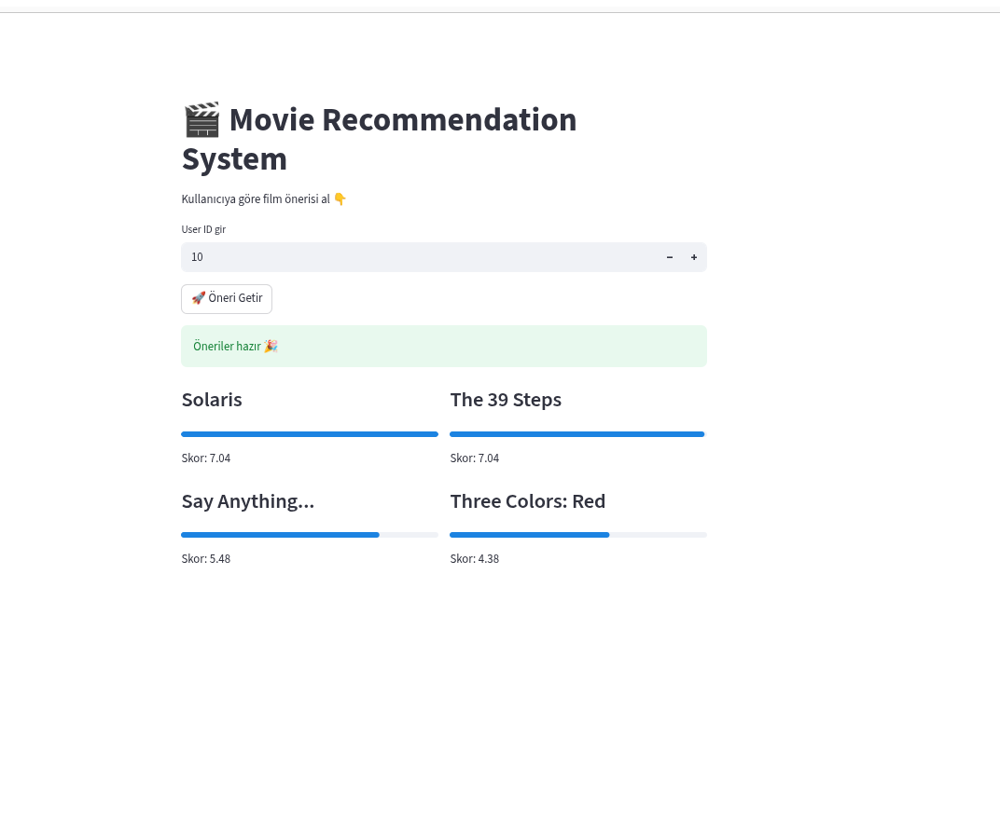
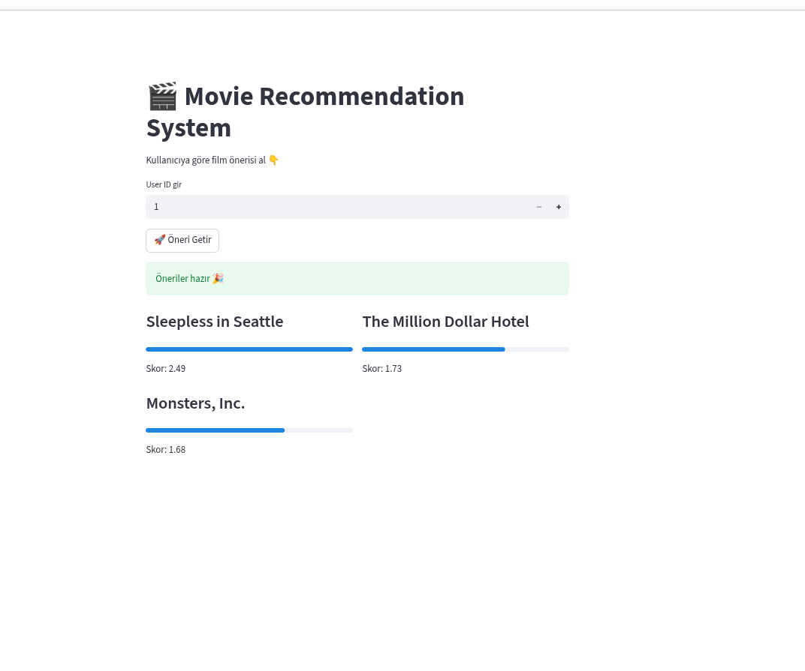

# 🎬 Movie Recommendation System

This project is an end-to-end movie recommendation system built using collaborative filtering.

## 🚀 Features
- User-based collaborative filtering
- Cosine similarity for finding similar users
- FastAPI backend for serving recommendations
- Streamlit frontend for user interaction

## 🛠 Tech Stack
- Python
- Pandas
- Scikit-learn
- FastAPI
- Streamlit

## ⚙️ How It Works
1. Users are represented as vectors of movie ratings
2. Similar users are found using cosine similarity
3. Movies liked by similar users are recommended

## 📂 Project Structure

```bash
movie-recommender/
│
├── api/
│   └── app.py
│
├── frontend/
│   └── frontend.py
│
├── data/
│   ├── ratings_small.csv
│   └── movies_metadata.csv
│
├── requirements.txt
└── README.md

## ▶️ Run the Project

### 1. Start API

uvicorn api.app:app --reload

### 2. Start Frontend

streamlit run frontend/frontend.py

## 📌 Example Usage

Enter a user ID and get movie recommendations instantly.

## 💡 Future Improvements
- Add movie posters
- Deploy to cloud (Render / Railway)
- Optimize recommendation speed

---


## 📸 Demo

### User 1 Recommendations


### User 10 Recommendations
